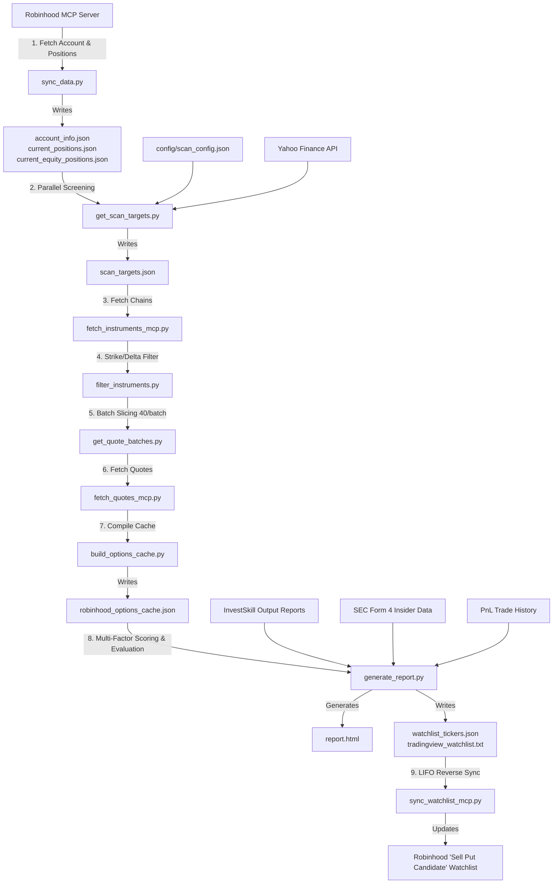

# The Sell Put King: Quantitative Option Strategy & Portfolio Management Engine

> **投资信条 (Core Philosophy)**:
> **最赚钱的 4 门生意 —— 开赌场，卖保险，收租子，放贷子。收割恐惧（Vega），贪婪（Gamma），时间（Theta），空间（Delta）。**

[](https://www.python.org/)
[](tests/)
[](src/option_quant/)
[](https://iamtroyh.github.io/the-sell-put-king/examples/sample_report_en.html)
[](LICENSE)

Production-grade quantitative options engine for **Sell Put (Cash Secured Put)** and **Covered Call** strategy recommendation, [**InvestSkill**](https://github.com/yennanliu/InvestSkill) institutional equity research synthesis, automated **Robinhood** portfolio management, and real-time **Portfolio Delta Notional Exposure / Leverage Ratio** risk governance.

> **Instant Live Preview**: Explore the [**Interactive Strategy & Portfolio Dashboard**](https://iamtroyh.github.io/the-sell-put-king/examples/sample_report_en.html) live via GitHub Pages without any local setup.

---

## Table of Contents
1. [Quickstart & Master Workflow Guide](#quickstart--master-workflow-guide)
2. [Dual Operational Modes: Standalone (No MCP) vs Automated (Robinhood MCP)](#dual-operational-modes-standalone-no-mcp-vs-automated-robinhood-mcp)
3. [System Architecture & Directory Layout](#system-architecture--directory-layout)
4. [End-to-End Data Pipeline & Strategy Flow](#end-to-end-data-pipeline--strategy-flow)
5. [Quantitative Multi-Factor Scoring Models & Risk Controls](#quantitative-multi-factor-scoring-models--risk-controls)
6. [Installation & Setup](#installation--setup)
7. [External MCP Servers & Underlying Financial Data Sources](#external-mcp-servers--underlying-financial-data-sources)
8. [Unified CLI Command Line Interface & Usage Guide](#unified-cli-command-line-interface--usage-guide)
9. [Python API Programming Interface Examples](#python-api-programming-interface-examples)
10. [Automated Testing & Quality Assurance](#automated-testing--quality-assurance)
11. [Output Deliverables & Interactive Reports](#output-deliverables--interactive-reports)

---

## Quickstart & Master Workflow Guide

### ⚡ 5-Minute Quick Start (快速启动指引)

Get up and running in **5 simple terminal commands**:

```bash
# 1. Clone the repository
git clone https://github.com/YOUR_USERNAME/the-sell-put-king.git
cd the-sell-put-king

# 2. Install Python dependencies
pip install -r requirements.txt

# 3. Initialize configuration template
cp config/credentials.json.example config/credentials.json

# 4. (Optional) Set your Robinhood Account ID for live MCP sync
# Edit config/credentials.json OR export via environment variable:
export ROBINHOOD_ACCOUNT_ID="YOUR_ACCOUNT_ID_HERE"

# 5. Run the master quantitative options research pipeline
python3 -u scripts/run_research.py

# 6. Open the interactive visual trading dashboard
open report.html
```

---

### Step 1: Clone Repository & Install Dependencies
```bash
# 1. Clone the repository
git clone https://github.com/YOUR_USERNAME/the-sell-put-king.git
cd the-sell-put-king

# 2. Install dependencies in editable mode to register the unified the-sell-put-king CLI
pip3 install -e .
```

### Step 2: Configure Account Credentials (Optional / For Live Robinhood Sync)
If using a live Robinhood account for automated cash/position ingestion and mobile Watchlist synchronization:
```bash
# Copy the credential template
cp config/credentials.json.example config/credentials.json
chmod 600 config/credentials.json
```
Populate your Robinhood Account ID inside `config/credentials.json` (or export via environment variable `export ROBINHOOD_ACCOUNT_ID="YOUR_ACCOUNT_ID"`):
```json
{
  "robinhood_account_id": "YOUR_ROBINHOOD_ACCOUNT_ID",
  "account_type": "Joint Tenancy",
  "marketdata_token": "OPTIONAL_MARKETDATA_TOKEN"
}
```
*(Note: If operating in Standalone mode with Schwab, Fidelity, IBKR, Webull, or no MCP, skip this step).*

---

### Step 3: Launching Workflows

This system natively supports both **Conversational AI Agent interaction** and **Local Terminal CLI commands**:

#### Mode A: Conversational AI Agent (Antigravity / Cursor / Claude Desktop / Roo Code / Cline)

Open the project workspace in your MCP-equipped AI coding environment and issue conversational commands:

| Command to Agent | Pipeline Execution Flow | Target Scenario & Deliverables |
| :--- | :--- | :--- |
| **`research`** | 1. Ingests unleveraged buying power, active option/stock positions, and past 30-day Wash Sale losses;<br>2. Concurrently scans 80+ blue-chip equities & ETFs for 200-SMA and 52-week valuation troughs;<br>3. Fetches DTE 15~60 option chains, executing Three-Pillar 40/30/30 quantitative scoring (Valuation Floor, Cushion & Max Pain, Option Alpha EV expectation, Kelly sizing, True IVP/IVR, Panic Skew, Piotroski & Insider Sentiment);<br>4. Compiles the interactive research dashboard [`report.html`](report.html);<br>5. Synchronizes top-ranked candidates to Robinhood App `Sell Put Candidate` Watchlist via LIFO reverse insertion. | **Daily / Weekly Portfolio Review**.<br>One-click portfolio action plan, market-wide opening recommendations, and mobile watchlist update. |
| **`research <TICKER>`**<br>*(e.g. `research AAPL` or `research LULU`)* | 1. Triggers the [`InvestSkill`](https://github.com/yennanliu/InvestSkill) 15-module institutional equity research engine;<br>2. Executes moat evaluation, 5-year DCF scenario valuation, bear-case red-team stress test, and 3-tier Sell Put gradient modeling;<br>3. Generates a standalone HTML report in `~/InvestSkill/output/` and embeds it seamlessly into Tab 2 of [`report.html`](report.html). | **Single-Stock Deep Dive**.<br>Comprehensive fundamental penetration and assignment suitability verification. |
| **`sync`**<br>*(or: `refresh watchlist` / `update positions`)* | 1. Refreshes live balances and open positions;<br>2. Recalculates portfolio Delta notional exposure and leverage ratio;<br>3. Re-pushes candidate rankings to Robinhood Watchlist. | **Intraday Quick Sync**.<br>Fast balance calibration and mobile watchlist alignment. |

---

#### Mode B: Local Terminal CLI Commands (Standalone / Zero Agent Dependency)

Execute unified CLI commands directly from your local terminal:

```bash
# 1. Full strategy pipeline & report generation (equivalent to 'research')
the-sell-put-king run
# Or via entry script: python3 scripts/run_research.py

# 2. Sync account balances, open positions, and portfolio delta
the-sell-put-king sync

# 3. Standalone market-wide value and long-bull scanner
the-sell-put-king scan

# 4. Single-contract Annualized Yield (APY) calculator
the-sell-put-king apy --strike 115 --premium 4.05 --dte 34

# 5. Portfolio Delta notional exposure and leverage ratio analysis
the-sell-put-king delta

# 6. SEC Form 4 insider sentiment query (90-day window)
the-sell-put-king insider LULU
```

---

### Step 4: Review Deliverables & Execute Trades

- **Instant Live Report (Zero Setup)**: Open the [**Live Interactive Sample Dashboard**](https://iamtroyh.github.io/the-sell-put-king/examples/sample_report_en.html) (or local file [`examples/sample_report_en.html`](examples/sample_report_en.html)) to inspect the full interactive dashboard, DTE-sorted positions table, Action Plan decision badges, multi-factor ranking tables, and Chart.js visualizations.
- **Live Interactive Dashboard**: Open [`report.html`](report.html) generated after running `the-sell-put-king run` or issuing `research` to review current position action plans, 3-tab candidate workbenches (Option Contracts / InvestSkill Deep Dive / Fundamental Valuation), and collateral budget metrics.
- **TradingView Import List**: Open [`data/tradingview_watchlist.txt`](data/tradingview_watchlist.txt), copy the comma-separated ticker list with accurate exchange prefixes (e.g. `NASDAQ:LULU, NYSE:ACN...`), and paste into TradingView.
- **Robinhood Mobile App**: Open the Robinhood App, navigate to the `Sell Put Candidate` Watchlist, and execute ranked contracts in descending score order.

---

## Dual Operational Modes: Standalone (No MCP) vs Automated (Robinhood MCP)

This system provides first-class support for both standalone operation without external brokers and automated direct integration with Robinhood:

| Capability Dimension | Mode A: Standalone Mode (Zero MCP) | Mode B: Automated Live Mode (Robinhood MCP) |
| :--- | :--- | :--- |
| **Target User Base** | **All Option Investors** (Schwab, Fidelity, IBKR, Webull, Futu, etc.) | **Robinhood Account Holders** |
| **Prerequisites** | **Python 3.9+ Only** (Zero MCP, zero private credentials, zero Node.js) | Python 3.9+ and Robinhood MCP Bridge |
| **Universe Scanning** | **Full Support** (Parallel Yahoo Finance market data and option chains) | **Full Support** |
| **Multi-Factor Scoring** | **Full Support** (Valuation, Cushion, HV30-adjusted yield, IVP) | **Full Support** |
| **Risk Governance** | **Full Support** (Piotroski F-Score, FCF, SEC Form 4 insider trading, VIX breakers) | **Full Support** |
| **Interactive Dashboard** | **Full Support** (Generates complete `report.html` & TradingView watchlist) | **Full Support** |
| **CLI Utilities** | **Full Support** (APY calculator, Delta exposure, insider sentiment) | **Full Support** |
| **Position Tracking** | **Manual Configuration** (Input positions in `data/current_positions.json`) | **Automated Ingestion** (Auto-syncs cash, positions, and basis) |
| **Watchlist Sync** | **TradingView Export** (Copy `data/tradingview_watchlist.txt`) | **Dual Sync** (Auto LIFO reverse push to Robinhood App) |

---

## System Architecture & Directory Layout

The project adheres to professional modular architecture: core package encapsulation (`src/option_quant/`), unified CLI management (`cli.py`), decoupled static configuration (`config/`), ephemeral runtime data (`data/`), backward-compatible dispatch scripts (`scripts/`), and comprehensive unit test coverage (`tests/`):

```
./
├── pyproject.toml                     # PEP 517/518 packaging and Pytest test configuration
├── requirements.txt                   # Production dependency manifest
├── report.html                        # Live interactive dashboard (runtime artifact, gitignored)
├── report_template.html               # HTML dashboard template framework (Chart.js & dark theme)
├── examples/                          # Standalone sample deliverables (tracked in git)
│   ├── sample_report_en.html          # Full interactive dashboard sample
│   ├── sample_account_info.json       # Account balance & theta data schema sample
│   └── sample_current_positions.json  # Open options position schema sample
├── src/option_quant/                  # Core quantitative options engineering package
│   ├── __init__.py                    # Package metadata and public symbol exports
│   ├── __main__.py                    # Module execution entry (python3 -m option_quant)
│   ├── cli.py                         # Unified CLI implementation (run, sync, scan, apy, delta, insider)
│   ├── config.py                      # Centralized path resolution, masking, and atomic JSON I/O
│   ├── mcp_client.py                  # Resilient Robinhood MCP JSON-RPC client (pagination & retries)
│   ├── market_data.py                 # Multi-threaded market fetcher, Piotroski F-Score, insider data
│   ├── marketdata_client.py           # High-speed MarketData API client, panic skew, Max Pain, PCR
│   ├── scoring.py                     # Three-Pillar Sell Put & CC scoring models, lognormal EV, Kelly sizing
│   ├── portfolio.py                   # Portfolio Delta notional exposure, leverage ratio, Wash Sale audit
│   ├── investskill.py                 # InvestSkill report indexing, mtime caching, and signal extraction
│   ├── html_renderer.py               # Modular HTML report generator & UI component builder
│   └── pipeline.py                    # Master workflow orchestrator and watchlist synchronizer
├── scripts/                           # Backward-compatible script wrappers & utilities
│   ├── run_research.py                # Main research entry script
│   ├── fast_option_scan.py            # High-speed concurrent option chain scanner (<3s)
│   ├── fetch_true_iv.py               # True 252d IVP / IVR & derivative metrics fetcher
│   ├── sync_data.py                   # Account data & position ETL
│   ├── get_scan_targets.py            # Market-wide valuation trough scanner
│   ├── filter_instruments.py          # Strike & Delta initial contract filtering
│   ├── get_quote_batches.py           # 40-item quote batching slicer to prevent packet loss
│   ├── build_options_cache.py         # Local structured options database compiler
│   ├── generate_report.py             # Multi-factor scoring and interactive report generator
│   ├── sync_watchlist_mcp.py          # Robinhood Watchlist LIFO reverse synchronizer
│   ├── portfolio_delta.py             # Portfolio Delta notional exposure CLI tool
│   ├── option_apy_calculator.py       # Annualized yield (APY) interactive CLI calculator
│   ├── insider_sentiment.py           # SEC Form 4 insider sentiment analyzer
│   ├── sync_investskill.py            # InvestSkill report indexer and refresher
│   ├── fetch_account_data_mcp.py      # Account balance MCP caller
│   ├── fetch_pnl_history_mcp.py       # Realized PnL MCP caller for Wash Sale auditing
│   ├── fetch_instruments_mcp.py       # Option chain instrument ID fetcher
│   ├── fetch_quotes_mcp.py            # Sliced quote batch fetcher
│   └── ticker_config.py               # Backward-compatible symbol normalization adapter
├── tests/                             # Automated test suite (Pytest)
│   ├── test_config.py                 # Normalization, exchange mapping, and atomic I/O tests
│   ├── test_scoring.py                # BS Delta, APY, Sell Put/CC scoring, and penalty tests
│   ├── test_portfolio.py              # Delta notional, leverage ratio, and Wash Sale tests
│   ├── test_market_data.py            # Piotroski F-Score, EVA, and circuit breaker tests
│   ├── test_investskill.py            # Regex report parsing and freshness audit tests
│   └── test_cli.py                    # CLI argument parsing and dispatch tests
├── config/                            # Strategy configuration and metadata
│   ├── credentials.json               # Local Robinhood joint account ID (permissions 0600)
│   ├── credentials.json.example       # Template configuration file
│   ├── scan_config.json               # Scanning universe, DTE/Delta ranges, and thresholds
│   └── ticker_metadata.json           # Ticker descriptions, risk notes, GICS mapping, and exchange tags
└── data/                              # Ephemeral runtime cache & database (all gitignored)
    ├── account_info.json              # Account equity, unleveraged cash, and daily theta
    ├── current_positions.json         # Open options positions and live PnL
    ├── current_equity_positions.json  # Open stock holdings and average basis
    ├── scan_targets.json              # Target tickers and valid expirations
    ├── filtered_instruments.json      # Pre-filtered candidate contracts
    ├── quote_batches.json             # 40-item batch query slices
    ├── raw_quotes.json                # Cleaned real-time options quotes
    ├── robinhood_options_cache.json   # Local structured option chain database
    ├── portfolio_delta_exposure.json  # Portfolio Delta notional exposure and leverage ratio
    ├── trade_pnl_history.json         # 30-day realized trade history for Wash Sale auditing
    ├── insider_sentiment_cache.json   # SEC Form 4 insider sentiment cache
    ├── market_history_cache.json      # 52w high/low, 200-SMA, HV30, and VixFix price history
    ├── investskill_cache.json         # InvestSkill report index cache
    ├── tradingview_watchlist.txt      # Comma-separated TradingView import list
    └── watchlist_tickers.json         # Synchronized Robinhood candidate list
```

---

## End-to-End Data Pipeline & Strategy Flow

The system coordinates specialized functional stages via atomic JSON payloads:



---

## Quantitative Multi-Factor Scoring Models & Risk Controls

### 1. Sell Put Three-Pillar Multi-Factor Scoring Model (40 / 30 / 30)
$$\text{Total Score} = \max\left(0, 0.40 \times S_{\text{Price}} + 0.30 \times S_{\text{Safety}} + 0.30 \times S_{\text{OptionAlpha}} - \text{Penalties} + \text{Bonuses}\right)$$

| Factor Pillar | Weight | Underlying Quantitative Drivers & Formulations | Strategic & Risk Objectives |
| :--- | :---: | :--- | :--- |
| **Pillar 1: Dual-Anchor Max-Discount Valuation Floor ($S_{\text{Price}}$)** | 40% | **Dual-Anchor Engine**: Concurrently evaluates 200 SMA Deviation ($S_{\text{Price\_SMA}}$) and 52-Week High-Low Relative Position ($S_{\text{Price\_RP}}$) with 50-baseline symmetric normalization, taking the maximum advantage discount: $S_{\text{Price}} = \max(S_{\text{Price\_SMA}}, S_{\text{Price\_RP}})$.<br>• **Long-Bull Anchor**: $Dev_{\text{basis}} = \frac{\text{Net Basis} - \text{SMA}_{200}}{\text{SMA}_{200}}$ (floor at -15.0%). If $Dev \le 0.0$, $S_{\text{Price\_SMA}} = 50.0 + \min(50.0, \frac{\|Dev\|}{35.0\%} \times 50.0)$; else $S_{\text{Price\_SMA}} = \max(0, 50.0 - \frac{Dev}{30.0\%} \times 50.0)$.<br>• **High-Vol Anchor**: $RP_{\text{basis}} = \frac{\text{Net Basis} - \text{Low}_{52\text{w}}}{\text{High}_{52\text{w}} - \text{Low}_{52\text{w}}}$. If $RP \le 0.50$, $S_{\text{Price\_RP}} = 50.0 + \min(50.0, \frac{0.50 - RP}{0.60} \times 50.0)$; else $S_{\text{Price\_RP}} = \max(0, 50.0 - \frac{RP - 0.50}{0.50} \times 50.0)$. | Rewards deep OTM strike discounts on net acquisition basis $\text{Net Basis} = \min(\text{Spot}, K - P_{\text{market}})$; eliminates single-anchor classification bias. |
| **Pillar 2: Safety Cushion & Gravitational Barrier ($S_{\text{Safety}}$)** | 30% | **Contract Safety Cushion**: $S_{\text{Safety}} = \text{clip}\left((1 - \vert\text{Delta}\vert) \times 100 + \max(\text{Valuation\_Bonus}_{\text{SMA}}, \text{Valuation\_Bonus}_{\text{RP}}) + \Delta_{\text{Pain}}, 0, 100\right)$.<br>• **Continuous Valuation Safety Bonus**: $\text{Valuation\_Bonus}_{\text{SMA}} = \min(10.0, \|Dev_{\text{spot}}\| \times 50.0)$, $\text{Valuation\_Bonus}_{\text{RP}} = \min(10.0, (0.20 - RP_{\text{spot}}) \times 50.0)$.<br>• **Max Pain Pinning Barrier ($\Delta_{\text{Pain}}$)**: Continuous smooth linear ramp $\Delta_{\text{Pain}} = \text{clip}\left(\frac{d_{\text{pain}}}{5.0\%} \times 4.0, -4.0, +4.0\right)$. | Prevents model bias from selecting dangerous ATM strikes; rewards deep safety cushions and structural option magnet pinning defenses. |
| **Pillar 3: Mathematical Expectation & Option Alpha ($S_{\text{OptionAlpha}}$)** | 30% | **Unified Option Alpha Engine**: $S_{\text{OptionAlpha}} = 0.70 \times S_{\text{EV\_APY}} + 0.30 \times S_{\text{Vol}}$.<br>• **Square-Root Saturation EV ($S_{\text{EV\_APY}}$)**: $S_{\text{EV\_APY}} = \min\left(100, 100 \times \sqrt{\frac{\mathbf{EV\ APY}}{20.0\%}}\right)$, driven by closed-form lognormal Black-Scholes expectation $\text{EV} = 100 \times [P_{\text{exec}} - \text{BS\_Put}(\text{HV}_{\text{effective}})]$.<br>• **Forward-Looking Sigma Damping**: Dampens $\sigma = \min(\text{raw\_sigma}, 1.15 \times \text{IV})$ when IV cools post-drop, eliminating backward-looking jump distortion.<br>• **4-Tier Action Taxonomy**: `💰 Premium Harvesting` ($\text{EV} > +\$10, \text{IVP} \ge 35\%$), `🟢 Steady Harvesting` ($-\$150 \le \text{EV} \le +\$10$), `💎 Discount Assignment` ($\text{EV} < -\$150$ on fortress assets / ETFs), and `⚠️ Thin Yield` ($\text{EV} < -\$150$ on non-quality assets).<br>• **Tri-Factor Volatility Surface ($S_{\text{Vol}}$)**: $S_{\text{Vol}} = 0.50 \times \text{IVP} + 0.20 \times \text{IVR} + 0.30 \times S_{\text{Skew}}$ utilizing true 252d implied volatility percentiles and 25-Delta panic put skew. | Balances pure Theta harvesting and volatility mispricing while protecting fortress equity accumulation during volatility troughs. |

#### Calibrated Risk Penalties & Fortress Bonuses ($\text{Penalties}$ & $\text{Bonuses}$)
- **Smart Drop Classifier**:
  * 🟢 **Contrarian Golden Pit**: 10%~30% drop on fortress assets ($F \ge 7$ & $\text{FCF} > 0$, or ETF, or Insider Net Buying $\ge \$500\text{K}$) is 100% exempt from knife penalty + awards continuous smooth golden pit bonus up to **+4.0 pts** ($\min(4.0, \frac{\text{drop} - 10\%}{15\%} \times 4.0)$).
  * 🟡 **Technical Pullback**: Continuous smooth quadratic ramp starting from 10% drop ($\min(15.0, (\frac{\text{drop} - 10\%}{25\%})^{1.2} \times 15.0)$), eliminating step cliffs.
  * 🔴 **Toxic Falling Knife / Structural Collapse**: Steep non-linear penalty on fundamentally deteriorating assets ($\min(30.0, (\frac{\text{drop} - 10\%}{25\%})^{1.3} \times 30.0 \times 1.3)$).
  * ⛔ **Black Swan Halt**: 30-day drop > 35% on individual stocks or > 22% on ETFs triggers hard 50 pt veto.
- **Panic-Cleared Volatility Compression Bottoming Bonus**: Underlying pullback ($\text{drop} \ge 8\%$ or spot $Dev \le -6.0\%$) with calm IV ($\text{IVP} \le 30\%$ or $\text{IV} < \text{HV}$) on fortress assets ($F \ge 7$ & $\text{FCF} > 0$, or broad ETF) awards **+1.5 ~ +3.5 pts** bottoming consolidation bonus and displays `[🕊️ Panic Cleared · Bottoming Signal]`.
- **DTE 30~45d Sweet Spot Efficiency Curve**: 28~45 DTE is 1.00x full efficiency. Ultra-short ($<28$ DTE) applies smooth convex yield reduction (down to 0.82x at 15 DTE) and Gamma spike penalty (up to 3.0 pts for DTE < 20). Long lockup ($>45$ DTE) applies capital velocity reduction (down to 0.90x at 60 DTE).
- **Wash Sale Tax Loss Disallowance Penalty**: Tickers with realized loss within 30 days automatically receive **-10.0 pts** tax avoidance penalty and display `[🚨 Wash Sale Tax Disallowance Warning (-10 pts)]`.
- **Piotroski F-Score Multi-Tier Smooth Health Ladder**: $F \le 2$ deducts 100 pts (severe collapse veto); $F = 3$ deducts 20 pts; $F = 4$ deducts 5 pts; $F = 5$ neutral (0 pts); $F = 6$ rewards +2.5 pts; $F = 7$ rewards +5.0 pts; $F \ge 8$ rewards +7.0 pts.
- **Structural Negative Free Cash Flow**: Continuous smooth linear penalty based on FCF margin ($\min(15.0, \frac{|\text{Margin}|}{20\%} \times 15.0)$ from 0% down to -20% margin).
- **Extreme Debt Leverage**: Sector-adapted continuous ramp (Standard 180%~320% D/E; Utilities & Real Estate 300%~550% D/E; halved if positive FCF and $F \ge 6$) up to 15 pts penalty.
- **SEC Form 4 Insider Sentiment**: Heavy selling ($\ge \$10\text{M}$ net selling) deducts 5 pts; Net buying ($\ge \$500\text{K}$) rewards +5 pts.
- **Earnings Expected Move Gatekeeper**: Continuous smooth ramp (5~15 pts when $0.60 \le m_{\text{earnings}} < 1.0$; 20 pts when $m_{\text{earnings}} < 0.60$; rewards +3 pts if cushion $\ge 1.5 \times \sigma_{\text{earnings}}$).
- **Contrarian Market Fear (PCR)**: Continuous smooth ramp ($\ge 0.95$ rewards up to +3.0 pts; $\le 0.70$ deducts up to -3.0 pts).

---

### 2. Earnings-DTE Smart Buffer
When earnings are scheduled within 30 days ($0 \le \text{DTE}_{\text{earnings}} \le 30$) and the option contract crosses the earnings announcement ($\text{DTE} > \text{DTE}_{\text{earnings}}$):
- **Mandatory Buffer**: Total contract duration must satisfy $\text{DTE} \ge \max(35, \text{DTE}_{\text{earnings}} + 14)$ to provide at least 14 days post-earnings stabilization.
- **Tighter Delta & Cushion**: Bounds Delta to `[-0.20, -0.10]` and mandates minimum safety cushion $\ge 10.0\%$.

---

### 3. Macro Circuit Breaker & VIX Rules
- **Yellow Defense (VIX $\ge 25$ or 30-day Index Drop $\ge 8\%$)**: Tightens Delta upper bound to `[-0.25, -0.10]`.
- **Red Deep OTM Defense (VIX $\ge 30$ or 30-day Index Drop $\ge 12\%$)**: Locks Delta to `[-0.15, -0.08]` with safety cushion $\ge 12.0\%$.
- **Black Swan Halt (VIX $\ge 40$)**: Halts all new CSP openings across the market.

---

### 4. InvestSkill Position Management Matrix
Portfolio positions are systematically evaluated across 6 disciplined action decisions:
1. **BTC (Profit Take / Inefficient Yield)**: Close when remaining APY falls below volatility baseline or PnL $\ge 80.0\%$.
2. **Hold (Greedy Hold / High-Yield Tail Exception)**: When PnL $\ge 50.0\%$, remaining APY $\ge$ Greedy threshold, and cushion $\ge 6.0\%$, hold to capture residual theta.
3. **BTC (Dynamic Take Profit)**: When PnL $\ge 50.0\%$ but remaining APY fails to justify residual tail risk, close to lock in profits.
4. **Roll / Assign (Expiring Boundary Defense)**: When DTE $\le 15$ and cushion $< 3.0\%$, roll down & out for net credit if quality is intact, or prepare cash for assignment. Stop-loss BTC is reserved only for thesis invalidation.
5. **Deep ITM (Early Assignment Readiness)**: When cushion $< -5.0\%$ (or Delta $< -0.60$) and DTE $> 15$, verify cash availability for wheel CC or await technical rebounds to roll.
6. **Hold (Standard Hold)**: Routine theta harvesting for healthy positions.

---

## Installation & Setup

### Environment Requirements
- Python 3.9+ (Python 3.10 / 3.11 / 3.12 fully supported)
- Git

### Installation Steps
```bash
# Clone the repository
git clone https://github.com/YOUR_USERNAME/the-sell-put-king.git
cd the-sell-put-king

# Install dependencies in editable mode
pip3 install -e .
```

---

## External MCP Servers & Underlying Financial Data Sources

### 1. Robinhood MCP Integration
Provides automated account synchronization, options trading data ingestion, and Watchlist management:
- **Account Binding**: Targets Joint Tenancy account ID from `config/credentials.json`.
- **Buying Power**: Mandatorily extracts `unleveraged_buying_power` from `get_portfolio`.
- **Batch Slicing**: Slices instrument quote requests into batches of $\le 40$ IDs to eliminate packet dropping.
- **LIFO Watchlist Insertion**: Automatically reverses sorted lists prior to calling `add_to_watchlist` so the mobile App displays descending rankings.

---

### 2. yfinance Market Data & Fundamentals
Integrates [**`yfinance`**](https://github.com/ranaroussi/yfinance) as the high-speed market data backbone:
- Multi-threaded parallel fetching of historical price series (200-SMA, 52w range, $\text{HV}_{30}$, Williams VixFix).
- Real-time options chain quotes and implied volatility tracking.
- Fundamental ratios: Piotroski F-Score metrics, Free Cash Flow, Debt-to-Equity, and forward P/E.
- SEC Form 4 insider transactions over 90-day windows.

---

### 3. InvestSkill Institutional Equity Research Framework
Deeply integrated with [**InvestSkill**](https://github.com/yennanliu/InvestSkill):
- Standardized 15-module / 5-phase / 9-chapter equity research architecture.
- 5-year DCF scenario valuation and intrinsic value calculations.
- Bear-case red-team stress testing (accounting divergences, dilution risk, debt maturity cliffs).
- 7-Day Freshness Guarantee: Reports exceeding 7 days are flagged for automatic regeneration.
- Adaptive iframe embedding inside Tab 2 of [`report.html`](report.html).

---

## Unified CLI Command Line Interface & Usage Guide

```bash
# 1. Full strategy pipeline & report generation (equivalent to 'research')
the-sell-put-king run

# 2. Account balance & position synchronization
the-sell-put-king sync

# 3. Market-wide valuation trough scanner
the-sell-put-king scan

# 4. Filter options contracts by strike and Delta
python3 scripts/filter_instruments.py

# 5. Compile local structured options cache
python3 scripts/build_options_cache.py

# 6. Re-score and render report.html
python3 scripts/generate_report.py

# 7. Push watchlist to Robinhood App
python3 scripts/sync_watchlist_mcp.py

# 8. Single-contract Annualized Yield (APY) calculator
the-sell-put-king apy --strike 115 --premium 4.05 --dte 34

# 9. Portfolio Delta notional exposure and leverage ratio analysis
the-sell-put-king delta

# 10. SEC Form 4 insider sentiment query
the-sell-put-king insider LULU
```

---

## Python API Programming Interface Examples

```python
from option_quant.scoring import (
    calculate_apy,
    calculate_put_delta,
    calculate_option_ev_and_pop,
    calculate_sell_put_score,
)
from option_quant.market_data import calculate_piotroski_f_score, get_fundamental_info
from option_quant.portfolio import calculate_portfolio_delta_exposure

# 1. Calculate Option Delta, APY, EV Expectation & POP
delta = calculate_put_delta(S=192.40, K=180.0, t=34/365.0, r=0.045, sigma=0.32)
apy_res = calculate_apy(dte=34, strike=180.0, premium=4.05)
ev_res = calculate_option_ev_and_pop(
    spot=192.40,
    strike=180.0,
    dte=34,
    premium=4.05,
    iv=0.32,
    hv=0.285
)
print(f"Delta: {delta:.2f}, Simple APY: {apy_res['simple_apy']:.1f}%, POP: {ev_res['pop']:.1f}%, EV: ${ev_res['ev_dollar']:+.2f}")

# 2. Compute Three-Pillar Multi-Factor Total Score (40 / 30 / 30)
total_score, s_price, s_safety, s_option_alpha, s_yield, penalty = calculate_sell_put_score(
    ticker="LULU",
    current_price=192.40,
    strike=180.0,
    delta=delta,
    mark=4.05,
    annualized_yield=apy_res['simple_apy'],
    ivp=65.0,
    dte=34,
    sma_200=224.0,
    low_52w=175.0,
    high_52w=260.0,
    curr_hv=28.5,
    ev_apy=ev_res['ev_apy'],
    ev_dollar=ev_res['ev_dollar'],
    pop=ev_res['pop'],
)
print(f"Total Score: {total_score:.1f}/100 (Price:{s_price:.0f} / Safety:{s_safety:.0f} / Alpha:{s_option_alpha:.0f})")

# 3. Analyze Piotroski F-Score Fortress Quality
fund_info = get_fundamental_info("MSFT")
f_score, f_checks = calculate_piotroski_f_score(fund_info)
print(f"MSFT Piotroski F-Score: {f_score}/9 -> {f_checks}")
```

---

## Automated Testing & Quality Assurance

Run the comprehensive unit test suite:

```bash
# Run all tests
pytest -q

# Run with test coverage
pytest --cov=src/option_quant tests/

# Run specific test modules
pytest tests/test_scoring.py
pytest tests/test_portfolio.py
pytest tests/test_market_data.py
```

### Test Scope
- [`tests/test_config.py`](tests/test_config.py): Normalization, exchange mapping, masking, and atomic I/O.
- [`tests/test_scoring.py`](tests/test_scoring.py): Black-Scholes Delta boundary checks, APY, multi-factor scoring, trend penalties, and F-Score bonuses.
- [`tests/test_portfolio.py`](tests/test_portfolio.py): Portfolio Delta notional exposure, leverage tiers, and Wash Sale audit logic.
- [`tests/test_market_data.py`](tests/test_market_data.py): Piotroski 9-point criteria, EVA/Moat evaluation, and VIX circuit breakers.
- [`tests/test_investskill.py`](tests/test_investskill.py): Research report regex extraction and 7-day freshness validation.
- [`tests/test_cli.py`](tests/test_cli.py): CLI argument parsing and command dispatch.

---

## Output Deliverables & Interactive Reports

1. **Instant Static Sample Report**: [**Live GitHub Pages Dashboard**](https://iamtroyh.github.io/the-sell-put-king/examples/sample_report_en.html) / [`examples/sample_report_en.html`](examples/sample_report_en.html)
   - Tracked in git and deployed on GitHub Pages; immediately viewable in any browser without configuration.
   - Includes full quantitative portfolio dashboard, DTE sorting, Action Plan decision badges, multi-factor candidate recommendations, and interactive Chart.js visualizations.
   - Accompanying data schema samples: [`examples/sample_account_info.json`](examples/sample_account_info.json) and [`examples/sample_current_positions.json`](examples/sample_current_positions.json).

2. **Live Interactive Dashboard**: [`report.html`](report.html)
   - Generated upon running `the-sell-put-king run` or issuing `research` (gitignored for privacy).
   - Features 3 structured tabs (Option Contracts / InvestSkill Deep Dive / Fundamental Valuation).
   - Sticky freeze master headers for seamless multi-thousand-pixel scrolling.
   - Real-time Wash Sale risk warnings, macro circuit breaker banners, and collateral budget metrics.

3. **TradingView Watchlist Import List**: [`data/tradingview_watchlist.txt`](data/tradingview_watchlist.txt)
   - Accurate exchange prefixes formatted for direct copy-paste into TradingView.

4. **Synchronized Robinhood Watchlist**: [`data/watchlist_tickers.json`](data/watchlist_tickers.json)
   - Ranked in descending multi-factor score order and pushed to the Robinhood mobile App.
